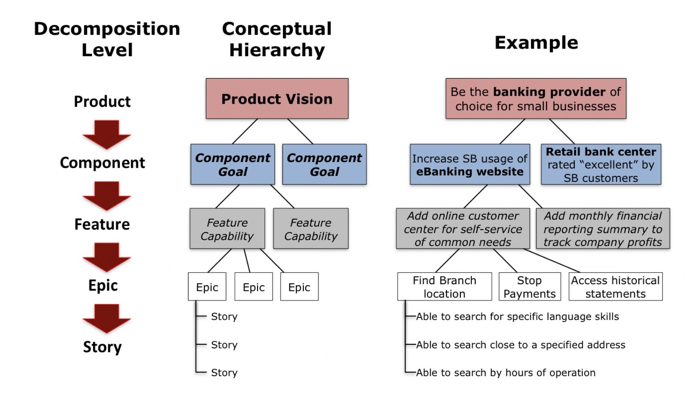

<!-- omit in toc -->
# Product Backlog

Consists of **work to be done** ordered by business value. Anyone can put anything on the backlog.
Product Owner is the final authority on ordering the backlog. The backlog consists of Product Backlog Items (PBIs).

DEEP:

- Detailed appropriately
- Estimated
- Emergent
- Prioritised

<!-- omit in toc -->
## Contents

- [1. Product Backlog Items (PBIs)](#1-product-backlog-items-pbis)
- [2. Backlog Progression](#2-backlog-progression)
- [3. Creating the Product Backlog](#3-creating-the-product-backlog)
  - [3.1 Decomposition Hierarchy](#31-decomposition-hierarchy)
  - [3.2 Breaking Epics into User Stories](#32-breaking-epics-into-user-stories)
  - [User Story Template](#user-story-template)
  - [Readiness Guidelines: INVEST in good user stories](#readiness-guidelines-invest-in-good-user-stories)
  - [3.3 READY backlog](#33-ready-backlog)
  - [3.4 Definition of Done (DoD)](#34-definition-of-done-dod)
  - [3.5 Acceptance Criteria: cheatsheet](#35-acceptance-criteria-cheatsheet)
  - [3.6 Acceptance Criteria vs Definition of Done](#36-acceptance-criteria-vs-definition-of-done)
- [4. Methods for ORDERING the Product Backlog](#4-methods-for-ordering-the-product-backlog)
- [5. Methods for PRIORITIZING the Product Backlog](#5-methods-for-prioritizing-the-product-backlog)
  - [5.1 MoSCoW](#51-moscow)
  - [5.2 Value vs Risk](#52-value-vs-risk)

## 1. Product Backlog Items (PBIs)

- PBIs include everything the team needs to do in one ordered set of activities
- wherever possible, PBIs should deliver complete vertical slices of functionality across work
  layers
- User stories are used as PBIs

## 2. Backlog Progression

1. Gather requirements by meeting with stakeholders and end-users
2. Create the product backlog
3. Refine the product backlog
4. Prepare the definition of READY for each user story
5. Organize the READY backlog by sprints
6. Have the sprint planning session to estimate user stories for the next sprint
7. Finalize the **sprint backlog**

## 3. Creating the Product Backlog

### 3.1 Decomposition Hierarchy

1. Product vision
2. Component goal
3. Feature capability
4. Epic
5. User Story

**Reference:**
<https://managedagile.com/what-is-functional-decomposition-and-why-is-it-relevant-to-agile/>

### 3.2 Breaking Epics into User Stories

**Epic:**

As a frequent flyer **I want to** book flights customized to my preferences, so I save time.

**User Stories:**

- As a _frequent flyer_ **I want to** book a trip using miles so that I can save money.
- As a _frequent flyer_ **I want to** easily book a trip I take often so that I can save time.
- As a _premium_ frequent flyer **I want to** request an upgrade so I can be more confortable.

### User Story Template

- As a **(role)** I would like to be able to **(action)** to achieve **(business value)**
- The goal of using stories written like this is to create a face to face conversation about what is
  needed from the end user’s perspective that includes internal acceptance tests
- Examples: [Story Fabricator](http://storyfabricator.herokuapp.com/)

### Readiness Guidelines: INVEST in good user stories

- **I**mmediately actionable: Can it be delivered independently? Is it free from external blockage?
- **N**egotiable: Descriptive enough to support team debate and conversation?
- **V**aluable: Delivers customer or business visible benefit?
- **E**stimable: Clear enough that team can estimate?
- **S**ized to fit: Divided into small enough blocks to complete within Sprint?
- **T**estable: Clear acceptance criteria to know when it is "good enough"?

### 3.3 READY backlog

- Defined clearly enough that all members of the team understand what must be done
- Includes team-developed tasking, if needed
- Assume some ongoing discussion to refine, coordinate and clarify
- Includes clear statement of resulting business value that allows the Product Owner to prioritize
- Includes any required enabling specs, wire frames, etc.
- Fully meet INVEST criteria for user stories
- Estimated and sized to complete easily within one sprint
- Free from external dependencies (i.e. there is nothing beyond the team’s control that must be done
  first in order to complete the story)

### 3.4 Definition of Done (DoD)

- **Definition of Done (DoD)** is decided on beforehand – along with acceptance tests
- DoD can be standard across a group of common stories
- Acceptance Criteria can be specified for unique ones
- Done means the feature has been developed, tested AND meets all required acceptance tests
- Ideally, Done means the feature could be shipped to a customer
- Product Owner officially “accepts” Done features back from Team at the Sprint Review meeting

### 3.5 Acceptance Criteria: cheatsheet

1. Must be expressed clearly, in simple language the customer would use
2. Think through how a feature will work from the user's perspective
3. Set of statements, each with a clear pass/fail result
4. There is no partial acceptance: either a criteria is met or it is not
5. Must be actionable: easily translated into one or more manual/automated test cases
6. Acceptance Criteria should state intent, but not a solution
7. Remove ambiguity from requirements

### 3.6 Acceptance Criteria vs Definition of Done

- Acceptance Criteria, also known as ‘conditions of satisfaction’ are applied to an individual user
  story, and are used to confirm that the desired purpose of the story is met
- A clear description or list of outcomes that prove the story will be acceptable to the PO that
  this story is completed to their satisfaction
- These are typically written by the PO, but the team can help, and often do if it is a Kaizen or
  Technical Debt story
- DoD is a set of fixed criteria we apply to all user stories, in a product. Think of it as a
  quality mark when shipping the completed stories
- It can be thought of as a master set of standards that can be applied division or company wide

## 4. Methods for ORDERING the Product Backlog

**Bubble-sort strategy**

- take first two items - which one is more important?
- take second and third - which one is more important?
- keep doing it until sort is complete

**Low Priority First strategy**

- assume project does not complete one item - which item is given up?
- assume another is not complete - which one is given up?
- keep doing this and back into a forced ranking
- **More Comprehensive Approaches**
- planning poker
- financial metrics - NPV/point

## 5. Methods for PRIORITIZING the Product Backlog

### 5.1 MoSCoW

What we build first depends on competitive environment:

- **M**ust have this
- **S**hould have
- **C**ould be nice to have
- **W**on't have this - maybe later

### 5.2 Value vs Risk

- when prioritizing features, consider both value and risk
- build high value, high risk features first
- working software that includes high risk features confirms the architecture approach is viable (reduces risk of rework)
- more opportunity to make tradeoffs at the beginning of a project, if a risky feature takes longer to develop than expected
- consider low value, low risk features as ”nice to have”
- prioritize these features after all high value features
- eliminate high risk, low value features
